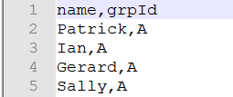
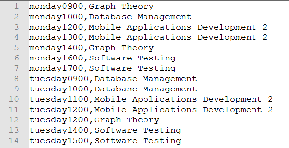

# Graph Theory Project 2017
## Patrick Moran

## [Contents](#contents)  
[Introduction](#intro)  
[About NEO4J](#about)   
[My Strategy](#strategy)   
[Stored Data](#storedData)    
[How The Data was Retrieved](#howDataRetrieved)  
[Implementation](#implementation)  
[Queries](#queries)  
[Conclusion](#conclusion)  
[References](#references)

## Introduction<a name = "intro"></a>   
This Project contains a Neo4j database for use in a timetabling system for [GMIT](https://www.gmit.ie/), Galway. The following document contains all of my design ideas and the instructions to use with this project. The database stores information about my current third year, semester 2, software development timetable.   
Main Information Stored:    
* Lecturer Name
* Room
* Time
* Student Group
* Subject
* Student Name

[Top](#contents)  
## About NEO4J<a name = "about"></a>    
  

[Neo4j](https://neo4j.com/) is a graph database management system. Neo4j is an ACID based system, ACID standing for Atomicity, Consistency, Isolation, Durability. Acid is a set of properties of database transactions. To be considered ACID, the database must satisfy these properties.

Neo4j community is a free open source software which is great for me as I'm a student interested in learning about it. There are also enterprise and government editions which require a license to use. Neo4j can be downloaded [here](https://neo4j.com/download/).  

Neo4j is implemented in java and works on all platforms.  

##### Data
Data in a Neo4j database is stored as either a node, an edge or an attribute. Each node and edge can have any number of attributes. Nodes and edges can also have labels. These labels can then be used to quickly find what your searching for.

##### Cypher
Cypher is a graph query language, similar to SQL, developed by Neo Technology to use with Neo4j graph database. Cypher is used to visually describe patterns in graphs.
Some cypher examples:  

Create a Node:      
``CREATE (you:Person {name:"You"})
RETURN you``        

Add a new relationship:  
``MATCH  (you:Person {name:"You"})  
CREATE (you)-[like:LIKE]->(neo:Database {name:"Neo4j" })  
RETURN you,like,neo ``

[Top](#contents)

## My Strategy<a name = "strategy"></a>
The first thing I had to figure out was what information I was going to store and then how much. I decided to use my current Third year, Software Development, Semester 2 module as the main source of data for my database. I then picked a small number of students, 8 all together, to simulate a college size number and dived these 8 into two groups of 4.   

Using a handy tool online, [ApcJones](http://www.apcjones.com/arrows/), I was able to draw out the nodes, attributes and relationships for my database. This design document was a big help when the time came to actually make the neo4j database.  

This was the Result:  

##### Database Design
  

I then started to put together all the csv files I would need to populate the database. More information on how I retrieved the data for the csv files can be found [here](#howDataRetrieved).

[Top](#contents)


## Stored Data<a name = "storedData"></a>  
Below is Information about All the nodes and relationships stored in the database.

##### Nodes Used
| Nodes |  Attribute(s) | Description |
|-------|---------------|-------------|
|Student | Name, Group ID | Every Student has a Name and Group ID they belong too. eg Patrick Moran, A|
|Group | Group ID | The group node has a group ID Attribute to which a student belongs. |
|TimeSlot |Name | The Time has a name attribute which stores the day and time of a lecture eg. mon0900 is Monday at 9am.|
|Subject| Code, Name | Every Subject has a code and a name eg. 48901, Graph Theory |
|Lecturer | Name | This node has an attribute called name eg. Ian McLoughlin |
|Room | Name, Capacity | The Room Node contains a name eg. 0995 and a capacity eg. 50|  

##### Relationships Between The Nodes
|Relationship|Description|Example|
|------------|-----------|-------|
|BELONGS_TO| A student BELONGS TO a group.| Patrick BELONGS TO Group A|
|ATTENDS| A group ATTENDS at a certain day/time| Group B ATTENDS at 9am on Monday|
|TAUGHT_AT| A subject is TAUGHT AT a certain day/time| Graph Theory is TAUGHT AT 2pm on a Monday|
|TEACHES_AT| A Lecturer TEACHES AT a certain day/time| Ian McLoughlin TEACHES AT 2pm on a Monday|
|ROOM_FOR| This is the ROOM FOR this day/time| 995 is the ROOM FOR Wednesday at 4pm |
|LECTURING| A Lecturer is LECTURING in this subject | Ian McLoughlin is LECTURING Graph Theory |


[Top](#contents)

## How The Data was Retrieved<a name ="howDataRetrieved"></a>  
While some data was entered manually, for example the fake list of students I created, most of the data for my neo4j database was taken from our [gmit](http://timetable.gmit.ie/) timetable.
I used view page source to find all the information I needed after which I copied and pasted that data into notepad++. Once in notepad++, I was able to manipulate the data using some of the text editors handy features.

[Top](#contents)

## Implementation<a name = "implementation"></a>  
Implementation of the database was broken down into three stages.
1. Creating the csv files
2. Creating the Nodes
3. Creating relationships between the nodes

###### Creating The CSV Files
After some research online, I thought the best way to import data into the neo4j database, was with the use of csv files.  
List of csv files used.  

* For Nodes  
  * Student    
  * Student Group  
  * Subject
  * Rooms
  * Lecturers
  * Time Slot   


* For Relationships
  * TimeSlot Group Relationships
  * TimeSlot Lecturer Relationship
  * Time Subject Relationship
  * Time Room Relationship  

To use these csv files with neo4j I had to create a folder called import and then put all those files in there. The import folder needs to be located in the default.graphdb folder inside the neo4j folder on your computer.

These csv files can be found in the CSV_Files folder at the [Top](#contents) of this readme. I found [Notepad++](https://notepad-plus-plus.org/download/v7.3.3.html) very useful for Creating and editing those csv files.

###### Creating Nodes
To show how I create these nodes, here is a snippet of the csv file.  

  

Here is the command I used to created the Student Nodes from that csv file.  
```
LOAD CSV WITH HEADERS FROM "file:///C:/student.csv" AS csvLine
CREATE (s:Student {  Name: csvLine.name, GrpId: csvLine.grpId})  
```
Name and grpId are the column headers and every Student node created has 2 attributes, name and group id.
I then repeated this process for student group, subject, room, lecturer and time slot.
###### Creating Relationships
This is how I created the relationship between the Students and the groups.  
```
MATCH (n:Student {GrpId:"A"}), (m:Group {GrpId:"A"}) CREATE(n)-[:BELONGS_TO]->(m) RETURN n, m
```
This command creates a BELONGS_TO relationship between all students with a group id attribute of 'A' to all Group nodes with a grpId of 'A'. I did the same for Group B aswell.

This is how I created the relationship between lectures and the subjects.  
```
MATCH (l:Lecturer {Name:"Damien Costello"}), (s:Subject {Name:"Mobile Applications Development 2"}) CREATE(l)-[:LECTURING]->(s) RETURN l, s
```
This command creates a LECTURING relationship between each Lecturer and a subject.  

I then used csv files to create the relationships between the remaining nodes. Here is how I created the TAUGHT_AT relationship between the subject and the timeslot using a csv file.   
CSV file snippet:  

  

And the Command I used to create the Relationship:  
```
LOAD CSV FROM "file:///C:/timeSubjectRelationship.csv" AS row
MATCH (t:TimeSlot {Name: toString(row[0])}), (s:Subject {Name: toString(row[1])})
CREATE (s)-[:TAUGHT_AT]->(t);
```
For each row in the csv file a relationship is created between the subject and the timeslot. This is very handy when dealing with large data sets.

[Top](#contents)  

## Queries<a name = "queries"></a>
This is a list of queries I put together after I completed the database.  
1. This Query shows me all the times on a Monday that Ian McLoughlin is lecturing at.
```
MATCH (l:Lecturer)-[r:TEACHES_AT]->(t:TimeSlot) WHERE l.Name = "Ian McLoughlin" AND t.Name  CONTAINS 'mon' RETURN l,t
```

2. This query returns a list of rooms, that are used on a Monday, with a room capacity greater than 50.
```
MATCH (r1:Room)-[r2:ROOM_FOR]->(t:TimeSlot) WHERE toInt(r1.Capacity) > 50 AND t.Name CONTAINS 'monday' RETURN DISTINCT r1.Name;
```

3. This query returns a list of group A students who have any graph theory lectures on a Monday.
```
MATCH (s1:Student {GrpId: "A"})-[r1:BELONGS_TO]->(g:Group)-[r2:ATTENDS]->(t:TimeSlot)<-[r3:TAUGHT_AT]-(s2:Subject) WHERE t.Name CONTAINS 'mon' AND s2.Name = 'Graph Theory' RETURN DISTINCT s1.Name
```

[Top](#contents)

## Conclusion<a name = "conclusion"></a>
Even though I'm more familiar with Relational Database systems, for example sql, I found Neo4j to have a much more modern approach to dealing with your data. This modern approach allows your data to be represented visually and is quite a testament to their system.

Cypher may appear hard to get your head around at first, but once your running neo4j on your system there are excellent tutorials provided for you to get you started no matter what your level is. These tutorials are available on the neo4j client.

Overall I found the project quite challenging, but when broken down into small steps, the task did become much easier.

[Top](#contents)

## References<a name = "references"></a>
* http://info.neo4j.com/rs/773-GON-065/images/neo4j_logo.png  
* https://neo4j.com/docs/
* https://en.wikipedia.org/wiki/Neo4j  
* https://neo4j.com/developer/cypher-query-language/    
* http://www.apcjones.com/arrows/  
* http://neo4j.com/docs/developer-manual/current/cypher/clauses/load-csv/

[Top](#contents)  
