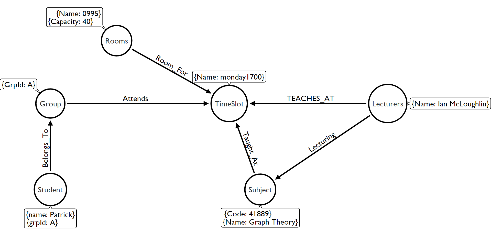

# Graph Theory Project 2017
## Patrick Moran

## [Contents](#contents)  
[Introduction](#intro)  
[About NEO4J](#about)   
[My Strategy](#strategy)   
[Stored Data](#storedData)    
[How The Data was Retrieved](#howDataRetrieved)  
[Implementation](#implementation)  
[Conclusion](#conclusion)  
[References](#references)

## Introduction   
This Project contains a Neo4j database for use in a timetabling system for [GMIT](https://www.gmit.ie/), Galway. The following document contains all of my design ideas and the instructions to use with this project. The database stores information about my current third year, semester 2, software development timetable.   
Main Information Stored:    
* Lecturer Name
* Room
* Time
* Student Group
* Subject
* Student Name

[Top](#contents)  
## About NEO4J    
  

[Neo4j](https://neo4j.com/) is a graph database management system. Neo4j is an ACID based system, ACID standing for Atomicity, Consistency, Isolation, Durability. Acid is a set of properties of database transactions. To be considered ACID, the database must satisfy these properties.

Neo4j community is a free open source software which is great for me as I'm a student interested in learning about it. There are also enterprise and government editions which require a license to use. Neo4j can be downloaded [here](https://neo4j.com/download/).  

Neo4j is implemented in java and works on all platforms.  

##### Data
Data in a Neo4j database is stored as either a node, an edge or an attribute. Each node and edge can have any number of attributes. Nodes and edges can also have labels. These labels can then be used to quickly find what your searching for.

##### Cypher
Cypher is a graph query language, similar to SQL, developed by Neo Technology to use with Neo4j graph database. Cypher is used to visually describe patterns in graphs.
Some cypher examples:  

Create a Node:      
``CREATE (you:Person {name:"You"})
RETURN you``        

Add a new relationship:  
``MATCH  (you:Person {name:"You"})  
CREATE (you)-[like:LIKE]->(neo:Database {name:"Neo4j" })  
RETURN you,like,neo ``

[Top](#contents)

## My Strategy
The first thing I had to figure out was what information I was going to store and then how much. I decided to use my current Third year, Software Development, Semester 2 module as the main source of data for my database. I then picked a small number of students, 8 all together, to simulate a college size number and dived these 8 into two groups of 4.   

Using a handy tool online, [ApcJones](http://www.apcjones.com/arrows/), I was able to draw out the nodes, attributes and relationships for my database. This design document was a big help when the time came to actually make the neo4j database.  

This was the Result:  

##### Database Design
  

I then started to put together all the csv files I would need to populate the database. More information on how I retrieved the data for the csv files can be found [here](#howDataRetrieved).

[Top](#contents)

## Stored Data  

[Top](#contents)

## How The Data was Retrieved
[Top](#contents)

## Implementation
[Top](#contents)

## Conclusion
[Top](#contents)

## References
* http://info.neo4j.com/rs/773-GON-065/images/neo4j_logo.png  
* https://en.wikipedia.org/wiki/Neo4j  
* https://neo4j.com/developer/cypher-query-language/    

[Top](#contents)  
